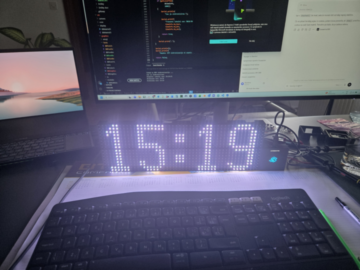

<p align="center">
  
</p>

# BLACKBLOX SDK

## From idea to working hardware in minutes.

### Create products. Not prototypes.

BLACKBLOX is a modular electronics platform that helps engineers, makers and companies build **real products** faster.

Instead of spending weeks designing PCBs, waiting for prototypes and redesigning hardware, you connect intelligent BLACKBLOX cubes, upload your software and start testing immediately.

Whether you're building a smart home device, industrial controller, IoT product or interactive display, BLACKBLOX lets you focus on creating your product—not rebuilding the hardware beneath it.

🌐 **Website:** https://get.blackblox.com

---

# Every product starts with an idea.

Some ideas become products.

Most never do.

Not because they aren't good enough.

But because building hardware takes time.

You design a PCB.

You order prototypes.

You wait.

You discover a mistake.

You redesign.

You wait again.

By the time the hardware finally works, part of the original excitement has already disappeared.

**BLACKBLOX was created to change that.**

Instead of redesigning electronics every time an idea changes, you simply reconnect reusable hardware modules and continue developing your software.

Less waiting.

More creating.

---

# Traditional Development vs. BLACKBLOX

| Traditional Hardware Development | Typical Time | BLACKBLOX Development | Typical Time |
|---------------------------------|-------------:|-----------------------|-------------:|
| 💡 New product idea | Day 0 | 💡 New product idea | Day 0 |
| Design PCB | 1–2 weeks | Connect BLACKBLOX cubes | 5 minutes |
| Manufacture prototypes | 1 week | Upload example | 2 minutes |
| Wait for delivery | 1–2 weeks | First test | 1 minute |
| Hardware issue discovered | — | Improve software | Immediately |
| Redesign PCB | 1 week | Add another module | 2 minutes |
| Manufacture again | 1 week | Continue development | Immediately |
| Repeat until hardware works | Months | Repeat until your customer is happy | Days |

---

# What is BLACKBLOX?

BLACKBLOX consists of two parts:

- **Modular electronic cubes**
- **Open-source SDK**

Each cube performs one task.

Examples include:

- RGB LED matrices
- Touch interfaces
- Displays
- Sensors
- GPIO expansion
- Processor cubes (ESP32, Raspberry Pi)
- Communication modules
- Future AI and vision modules

All cubes communicate over a common I²C-based architecture and can be combined into much larger systems without redesigning electronics.

---

# Hello BLACKBLOX

Getting started only takes a few lines of code.

```cpp
#include <BLACKBLOX.h>

using namespace blackblox;

BBRGBMatrix8x16 matrix(0x11);

void setup()
{
    BB.begin();

    matrix.begin();

    matrix.fill(BBColor::Blue);

    matrix.show();
}

void loop()
{
}
```

That's it.

Your first BLACKBLOX application is already running.

---

# Why BLACKBLOX?

✔ Modular hardware

✔ Open-source SDK

✔ Reusable electronics

✔ Rapid prototyping

✔ Professional products

✔ Scalable architecture

✔ ESP32 and Raspberry Pi support

✔ Designed for education, makers and industry

---

# Learn More

- 📖 Documentation → `docs/`
- 🚀 Getting Started → `docs/getting_started.md`
- 💡 Examples → `examples/`
- 🧩 Modules → `src/modules/`
