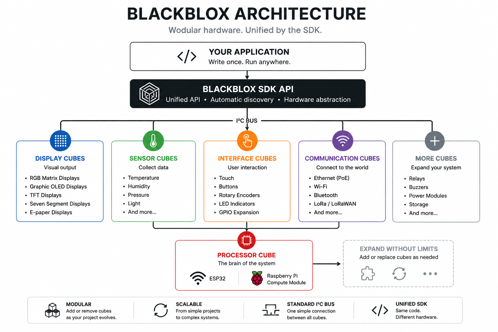

<p align="center">
  
</p>

<h1 align="center">BLACKBLOX SDK</h1>

<p align="center">
<b>From idea to working hardware in minutes.</b><br>
Create products. Not prototypes.
</p>

<p align="center">
Modular hardware platform and open-source SDK for building embedded products.
</p>

---

# Every product starts with an idea.

Some ideas become products.

Most never do.

Not because they aren't good enough.

But because hardware development is slow.

You design a PCB.

Wait for prototypes.

Find a mistake.

Redesign.

Wait again.

Repeat.

Weeks become months.

The original excitement slowly disappears.

# The Story Behind BLACKBLOX

Every engineer eventually notices the same thing.

Most new products aren't really new.

The display already existed.

The processor already existed.

The power supply already existed.

The communication interfaces already existed.

Only the product was new.

So why were we redesigning the hardware every single time?

That simple question became BLACKBLOX.

A platform built around one simple idea.

Reuse hardware.

Build products.

## BLACKBLOX changes that.

Instead of redesigning electronics for every new project, you build your product from reusable hardware cubes.

Need a display?

Add a display cube.

Need Wi-Fi connectivity?

Add an ESP32 processor cube.

Need Gigabit Ethernet?

Replace it with a Raspberry Pi Compute Module processor cube.

Need another sensor?

Connect another cube.

Your application evolves.

Your application evolves.

Your hardware evolves with it.

---

# Why BLACKBLOX?

BLACKBLOX is designed for engineers who want to spend their time creating products instead of repeatedly designing electronics.

| Traditional development | BLACKBLOX |
|--------------------------|-----------|
| Design a new PCB for every project | Reuse existing hardware cubes |
| Wait for manufacturing | Start immediately |
| Redesign after every mistake | Replace or add modules |
| Hardware first | Product first |
| Prototype after prototype | Continuous development |

The objective is simple.

**Reduce the time between an idea and a working product.**

---

# What is BLACKBLOX?

BLACKBLOX is a modular hardware ecosystem accompanied by an open-source SDK.

Processor cubes, displays, sensors, communication interfaces and expansion modules connect together using a common architecture.

Every cube has a single responsibility.

Every cube can be reused.

Every new project starts with hardware that already works.

Instead of creating electronics from scratch, you focus on software and product functionality.

---

# Hello BLACKBLOX

Getting started only takes a few lines of code.

```cpp
#include <BLACKBLOX.h>

using namespace blackblox;

BBRGBMatrix8x16 matrix(0x11);

void setup()
{
    BB.begin();

    matrix.begin();

    matrix.fill(BBColor::Blue);

    matrix.show();
}

void loop()
{
}
```

That's all.

No display driver configuration.

No framebuffer management.

No communication protocol.

Just create your application.

# How BLACKBLOX Works

Every BLACKBLOX application is built from independent hardware cubes.

Each cube has a clearly defined purpose.

A processor cube executes your application.

Display cubes present information.

Sensor cubes collect data.

Interface cubes allow user interaction.

Communication cubes connect your product to the outside world.

Each cube does one job.

Together they become a product.


<p align="center">
  
</p>

---

# The BLACKBLOX Architecture

The architecture is intentionally simple.

```
                 Your Application
                        │
                BLACKBLOX SDK API
                        │
        ┌───────────────┼───────────────┐
        │               │               │
   Display Cubes   Sensor Cubes   Communication
        │               │               │
        └───────────────┼───────────────┘
                        │
                 Processor Cube
```

Your application never communicates directly with the hardware.

Instead, every cube is accessed through the BLACKBLOX SDK.

This keeps applications simple, portable and easy to maintain.

---

# Processor Cubes

The processor cube is the heart of every BLACKBLOX installation.

It executes your application and coordinates communication with every connected cube.

Current processor platforms include:

- ESP32
- Raspberry Pi Compute Module

Future processor platforms will include:

- STM32
- RP2350

Applications should require little or no modification when moving between supported processors.

---

# Display Cubes

Display cubes provide visual output.

Current development includes:

- RGB Matrix Displays
- Graphic OLED Displays

Future display cubes include:

- TFT Displays
- Seven Segment Displays
- E-paper Displays

Multiple display cubes can be combined into one logical display.

Applications draw to a single graphics surface.

The SDK automatically distributes the image across all connected displays.

---

# Sensor Cubes

Sensor cubes bring real-world information into your application.

Examples include:

- Temperature
- Humidity
- Pressure
- Light
- Air Quality
- Water Quality
- Motion
- Position

Reading a sensor should be as simple as:

```cpp
float temperature = sensor.readTemperature();
```

The application doesn't need to know how the sensor communicates.

The SDK handles that.

---

# Interface Cubes

Many products require interaction.

BLACKBLOX supports dedicated interface cubes for:

- Capacitive touch
- Buttons
- Rotary controls
- RGB indicators
- Relays
- GPIO expansion

Applications use the same programming model regardless of the underlying hardware.

---

# Communication Cubes

Communication should be replaceable.

Instead of redesigning the entire product, simply change the communication cube.

Current and planned communication technologies include:

- Ethernet
- Wi-Fi
- Bluetooth
- USB
- CAN
- RS-485
- LoRa
- Cellular

Applications continue using the same API.

Only the hardware changes.

---

# The Graphics Engine

Graphics are built around a framebuffer.

Applications draw:

- Pixels
- Lines
- Rectangles
- Text
- Bitmaps
- Images

When drawing is complete:

```cpp
display.show();
```

The SDK transfers the framebuffer to the display automatically.

Applications never need to manipulate LEDs directly.

---

# Designed for Expansion

Most embedded products evolve over time.

BLACKBLOX was designed with that expectation.

Need another display?

Add another cube.

Need Ethernet?

Replace the communication cube.

Need AI?

Add a camera processor.

Your software continues growing.

Your hardware grows with it.

# BLACKBLOX SDK

Hardware should be simple to use.

The SDK should make it even simpler.

Every module follows the same design philosophy.

Create an object.

Initialize it.

Use it.

There is no need to understand communication protocols, register maps or hardware implementation details.

The SDK hides those details so you can focus on your application.

---

# SDK Design Principles

The BLACKBLOX SDK follows a small number of fundamental principles.

## Simple

The API should be easy to read.

Good code explains itself.

```cpp
matrix.clear();

matrix.drawText("BLACKBLOX");

matrix.show();
```

The intention is immediately obvious.

---

## Consistent

Every module behaves in a similar way.

```cpp
display.begin();

sensor.begin();

ethernet.begin();

camera.begin();
```

You learn the SDK once.

The same concepts apply everywhere.

---

## Modular

Applications only include the modules they actually use.

```cpp
#include <BLACKBLOX.h>

BBRGBMatrix8x16 display(0x11);
BBTemperatureSensor temperature(0x30);
```

Need another module?

Simply create another object.

---

## Hardware Independent

Applications should not depend on the processor.

The same application should be portable between:

- ESP32
- Raspberry Pi
- STM32
- RP2350

Only the platform layer changes.

Your application remains the same.

---

## Open

The SDK is completely open-source.

Applications are developed using standard C++.

There are no proprietary editors.

No proprietary compilers.

No vendor lock-in.

---

# Graphics Library

Displaying graphics should be as simple as drawing into memory.

The graphics library provides:

- Pixels
- Lines
- Rectangles
- Bitmaps
- Text
- Fonts
- Colors

Displays become graphical canvases instead of collections of LEDs.

---

## Fonts

Fonts are first-class SDK objects.

Current development includes:

- 5×7 fonts
- Variable-width fonts
- 8×8 fonts
- 8×16 fonts

Additional fonts can be created using the BLACKBLOX Font Editor.

---

## Matrix Displays

Multiple RGB matrices automatically become one larger display.

For example:

| Configuration | Resolution |
|--------------|-----------:|
| 1 Matrix | 16 × 8 |
| 2 Matrices | 16 × 16 |
| 6 Matrices | 48 × 16 |
| 12 Matrices | 48 × 32 |

Applications draw into a single framebuffer.

The SDK distributes the graphics automatically.

No application changes are required when additional displays are added.

---

# Examples

The repository contains complete examples demonstrating the SDK.

Examples currently include:

- Empty SDK project
- RGB Matrix test
- Matrix Clock
- Graphics demonstration

More examples are continuously added as new cubes become available.

---

# Repository Structure

```
blackblox-sdk/

├── docs/
│   ├── architecture.md
│   ├── getting_started.md
│   ├── modules/
│   ├── milestones/
│   └── SDK_DEVELOPMENT_LOG.md
│
├── examples/
│
├── src/
│   ├── core/
│   ├── graphics/
│   ├── modules/
│   └── platforms/
│
├── tools/
│
├── CHANGELOG.md
└── README.md
```

The repository is organized so both users and contributors can quickly find what they need.

Applications live inside **examples**.

The SDK itself lives inside **src**.

Documentation continues to grow inside **docs**.

# Build Real Products

BLACKBLOX was never intended to become another development board.

It was designed to become a product development platform.

Instead of starting every new project with electronics, you start with functionality.

The hardware is already there.

---

## Matrix Clock

A digital clock is one of the simplest BLACKBLOX projects.

Required cubes:

- Processor Cube
- RGB Matrix Cube

Possible extensions:

- Wi-Fi time synchronization
- Weather forecast
- Indoor temperature
- Humidity
- Ambient light sensor
- Touch control
- RGB animations

The same application can grow from a single display into a large wall installation without redesigning the electronics.

---

## Smart Home Display

Instead of placing several independent devices around your home, BLACKBLOX allows them to become one system.

Example information:

- Time
- Date
- Weather
- Energy consumption
- Solar production
- Room temperatures
- Alarm status
- Camera notifications

Each new feature is simply another cube.

---

## Pool Monitoring

A swimming pool combines many different sensors.

BLACKBLOX allows them to become one integrated product.

Possible modules:

- Water temperature
- Air temperature
- Humidity
- pH
- ORP
- Water level
- Pump control
- RGB information display

Additional functions can be added later without redesigning the controller.

---

## Industrial Applications

Industrial products rarely stop evolving.

Customers ask for:

- One more input.
- One more sensor.
- One more communication interface.

Traditional hardware often requires another PCB revision.

BLACKBLOX simply adds another cube.

---

## Laboratory Equipment

Many laboratory instruments share the same building blocks.

Displays.

Buttons.

Sensors.

Communication interfaces.

Logging.

Networking.

Instead of designing everything again, combine the cubes required by your application.

---

## Education

Students should spend their time learning engineering.

Not fighting development environments.

BLACKBLOX allows them to focus on:

- Programming
- Electronics
- Communication
- Embedded systems
- Product development

The hardware remains reusable between projects.

---

# Why Modular Hardware Matters

Every engineer eventually discovers the same problem.

The first version of a product is never the last.

Customers always request new features.

Traditional electronics often require another PCB revision.

Another prototype.

Another manufacturing cycle.

Another delay.

BLACKBLOX takes a different approach.

Products evolve by expanding the hardware instead of replacing it.

---

# Designed for Growth

A BLACKBLOX installation can begin with only two cubes.

Later you may add:

- More displays
- More sensors
- Camera modules
- Ethernet
- Audio
- Touch interfaces
- AI acceleration
- Additional processors

Applications continue growing without changing the overall architecture.

---

# From Prototype to Product

Many development platforms are excellent for prototypes.

Very few are designed with finished products in mind.

BLACKBLOX attempts to bridge that gap.

Prototype quickly.

Test early.

Improve continuously.

Deploy confidently.

The same platform accompanies the product throughout its entire lifecycle.

---

# Open Ecosystem

BLACKBLOX grows one cube at a time.

Every new module immediately becomes available to every future project.

Today's RGB Matrix Cube may become tomorrow's industrial controller.

Today's sensor may become part of next year's commercial product.

The value of the platform increases with every new cube.

That is the strength of modular hardware.

# Roadmap

BLACKBLOX is under active development.

The goal is not simply to release more hardware.

The goal is to build a complete ecosystem for embedded product development.

---

## SDK

Current priorities include:

- Improved graphics library
- Additional drawing primitives
- Animation framework
- Hardware abstraction improvements
- Cross-platform compatibility
- Performance optimization
- Extended documentation

---

## Processor Cubes

Current and planned processor platforms include:

- ESP32
- Raspberry Pi Compute Module
- STM32
- RP2350

Future processors can be added without changing application code.

---

## Display Cubes

Current development includes:

- RGB Matrix Displays
- Graphic OLED Displays

Planned additions include:

- TFT Displays
- Seven Segment Displays
- E-paper Displays
- Status Displays

---

## Sensor Cubes

The ecosystem will continue expanding with sensors for:

- Environmental monitoring
- Industrial automation
- Building automation
- Smart Home
- Pool control
- Agriculture
- Laboratory equipment

---

## Communication

Planned communication modules include support for:

- Ethernet
- Wi-Fi
- Bluetooth
- USB
- RS-485
- CAN
- LoRa
- Cellular

Applications should remain independent of the underlying communication technology.

---

## AI and Vision

Future development includes intelligent vision modules based on Raspberry Pi and dedicated AI image sensors.

Potential applications include:

- Object detection
- Number plate recognition
- QR and barcode reading
- Industrial inspection
- Smart Home automation

---

# Contributing

BLACKBLOX is an open project.

Ideas, bug reports and pull requests are always welcome.

Whether you contribute:

- Documentation
- Examples
- SDK improvements
- Hardware ideas
- New modules

your contribution helps the entire community.

---

# Documentation

The repository documentation continues to expand.

Available documents include:

- Getting Started
- Architecture
- SDK Development Log
- Module Documentation
- Examples

Additional documentation is added together with every major SDK feature.

---

# Support

If you have questions while using the BLACKBLOX SDK, there are several ways to get help.

- Read the documentation inside the `docs` folder.
- Browse existing GitHub Issues.
- Open a new Issue if you believe you've found a bug.
- Ask ChatGPT and mention that you're using the BLACKBLOX SDK together with the repository version or release number.

The SDK is under active development and community feedback helps improve both the software and the documentation.

---

# Frequently Asked Questions

## Is BLACKBLOX open source?

The SDK is completely open source.

---

## Which IDE should I use?

Use the development environment appropriate for your processor.

For example:

- Arduino IDE
- PlatformIO
- Visual Studio Code
- Raspberry Pi development tools

---

## Can I create my own cubes?

Yes.

The architecture is intentionally designed to allow future expansion.

---

## Can multiple cubes be combined?

Yes.

That is the entire philosophy behind BLACKBLOX.

Applications are built by combining independent hardware modules.

---

## Does the SDK support multiple processors?

That is one of the primary design goals.

Applications should remain portable between supported processor platforms.

---

# Design Philosophy

Every engineering decision inside BLACKBLOX follows a few simple principles.

## Simplicity

Complex systems should be simple to use.

---

## Reusability

Hardware should not become obsolete after a single project.

---

## Scalability

Products should grow without redesigning their electronics.

---

## Openness

Open standards encourage innovation.

---

## Longevity

Technology changes.

Good architecture survives those changes.

---

# Our Mission

We believe engineers should spend their creativity solving real problems.

Not repeatedly designing the same electronics.

Every week spent redesigning hardware is a week not spent improving the product.

BLACKBLOX exists to reduce that time.

To make embedded development more enjoyable.

More flexible.

More reusable.

More open.

One cube at a time.

---

<p align="center">

## From idea to working hardware in minutes.

### Create products.

# Not prototypes.

</p>

---

Thank you for visiting the BLACKBLOX project.

If you like the idea, give the repository a ⭐.

Every star helps the project reach more engineers.

Let's build something amazing.
---
